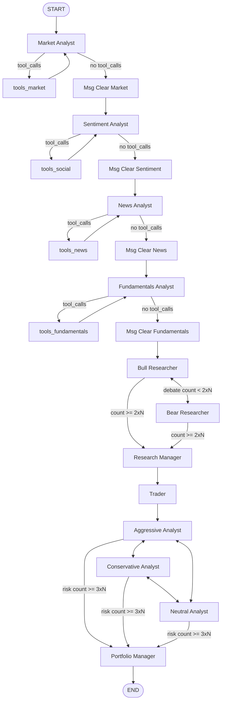

# Sơ đồ luồng agent thật — Phase 2.1 (audit, không sửa code)

> Nguồn đối chiếu:
> - Code: `tradingagents/graph/setup.py`, `conditional_logic.py`, `analyst_execution.py`, `trading_graph.py`, `propagation.py`, `signal_processing.py`, `checkpointer.py`.
> - Log thật: chạy baseline Bước 1.2 (AAPL, 2026-07-08) — file `~/.tradingagents/logs/AAPL/TradingAgentsStrategy_logs/full_states_log_2026-07-08.json`.
> - Cấu hình baseline: 4 analyst mặc định bật (market, social, news, fundamentals), `max_debate_rounds=1`, `max_risk_discuss_rounds=1`.

---

## 1. Sơ đồ node → node (mermaid)

Ghi chú đọc sơ đồ:
- Vòng `Market Analyst ⇄ tools_market` lặp lại cho đến khi model không còn `tool_calls` trong message cuối, rồi mới đi qua `Msg Clear Market` để dọn message trước khi sang analyst kế tiếp. Cùng cấu trúc cho social/news/fundamentals.
- Thứ tự 4 analyst **là thứ tự trong tham số `selected_analysts`**, không cố định — xem mục 4.
- Debate (Bull/Bear) và Risk (Aggressive/Conservative/Neutral) đều dùng router điều kiện dựa trên `count` trong state, không phải cạnh cố định.

---

## 2. Thứ tự chạy thật quan sát được (log Bước 1.2, config mặc định)

Từ `full_states_log_2026-07-08.json`, các field đều có giá trị (không rỗng), khớp đúng thứ tự thiết kế:

1. `market_report` → 2. `sentiment_report` → 3. `news_report` → 4. `fundamentals_report`
5. `investment_debate_state` (bull_history, bear_history, history, judge_decision — do **Research Manager** ghi `judge_decision`)
6. `investment_plan` (output Research Manager) → `trader_investment_decision` (Trader, lưu trong field `trader_investment_plan`)
7. `risk_debate_state` (aggressive/conservative/neutral history + `judge_decision` — do **Portfolio Manager** ghi)
8. `final_trade_decision` (= `risk_debate_state.judge_decision`, do Portfolio Manager sinh ra, cũng là nội dung parse ra rating 5 bậc)

Kết quả baseline: judge quyết định debate = "Overweight" (Research Manager), risk judge cuối = "Overweight" / 3% position (Portfolio Manager) → khớp `TEST_PLAN.md`.

**Đối chiếu:** sơ đồ trong mục 1 khớp hoàn toàn thứ tự field xuất hiện trong log thật. Không phát hiện sai lệch.

---

## 3. Vòng lặp điều kiện (không phải cạnh 1 chiều)

### 3.1 Vòng tool-call của mỗi analyst
File: `conditional_logic.py` — `should_continue_{market,social,news,fundamentals}`.
- Đọc `messages[-1].tool_calls`. Có → quay lại node tool tương ứng (`tools_market`/`tools_social`/`tools_news`/`tools_fundamentals`) → quay lại chính analyst đó.
- Không có → sang node `Msg Clear {Tên}` (dọn message) → analyst kế tiếp (hoặc `Bull Researcher` nếu là analyst cuối cùng trong `plan.specs`).

### 3.2 Vòng debate Nghiên cứu (Bull ⇄ Bear)
File: `conditional_logic.py` — `should_continue_debate`. Điều kiện dừng: `investment_debate_state["count"] >= 2 * max_debate_rounds`.
- Dừng → `Research Manager`.
- Chưa dừng: nếu `current_response` bắt đầu bằng "Bull" → sang `Bear Researcher`; ngược lại → `Bull Researcher`.
- `DEBATE_PATH_MAP` map đủ 3 đích (`Bull Researcher`, `Bear Researcher`, `Research Manager`) cho cả 2 cạnh điều kiện xuất phát từ Bull và Bear (tránh crash nếu speaker label lệch — xem comment `#1088` trong `setup.py`).

### 3.3 Vòng debate Rủi ro (Aggressive ⇄ Conservative ⇄ Neutral)
File: `conditional_logic.py` — `should_continue_risk_analysis`. Điều kiện dừng: `risk_debate_state["count"] >= 3 * max_risk_discuss_rounds`.
- Dừng → `Portfolio Manager`.
- Chưa dừng: theo `latest_speaker` — Aggressive vừa nói → Conservative; Conservative vừa nói → Neutral; còn lại (Neutral vừa nói, hoặc chưa ai nói) → Aggressive.
- `RISK_ANALYSIS_PATH_MAP` map đủ 4 đích cho cả 3 cạnh điều kiện (Aggressive/Conservative/Neutral).

Với config baseline (`max_debate_rounds=1`, `max_risk_discuss_rounds=1`): debate dừng sau 2 lượt (1 Bull + 1 Bear), risk dừng sau 3 lượt (Aggressive → Conservative → Neutral).

---

## 4. Thứ tự analyst không cố định trong code — do `selected_analysts` quyết định

`GraphSetup.setup_graph(selected_analysts=("market", "social", "news", "fundamentals"))` (mặc định trong `trading_graph.py`) gọi `build_analyst_execution_plan(selected_analysts)` (`analyst_execution.py`), sinh `plan.specs` **theo đúng thứ tự truyền vào tuple/list**, không phải thứ tự cố định trong `ANALYST_NODE_SPECS`.

- `workflow.add_edge(START, plan.specs[0].agent_node)` — analyst đầu tiên = phần tử đầu của `selected_analysts`.
- Vòng `for i, spec in enumerate(plan.specs)` nối `Msg Clear {spec}` → `plan.specs[i+1].agent_node`, hoặc → `"Bull Researcher"` nếu là phần tử cuối.

→ Sơ đồ ở mục 1 vẽ theo thứ tự mặc định `(market, social, news, fundamentals)` dùng trong baseline. Nếu Phase 3 đổi thứ tự hoặc bớt analyst, chuỗi nối tiếp (không phải router có điều kiện) sẽ đổi theo — đây chính là điểm Phase 3.1 cần thiết kế kỹ (state field nào bị thiếu khi 1 analyst bị bỏ khỏi `selected_analysts`).

Bảng tên node cố định theo `ANALYST_NODE_SPECS` (`analyst_execution.py`):

| key (wire) | agent_node (label) | clear_node | tool_node | report_key |
|---|---|---|---|---|
| `market` | Market Analyst | Msg Clear Market | tools_market | market_report |
| `social` | **Sentiment Analyst** | Msg Clear Sentiment | tools_social | sentiment_report |
| `news` | News Analyst | Msg Clear News | tools_news | news_report |
| `fundamentals` | Fundamentals Analyst | Msg Clear Fundamentals | tools_fundamentals | fundamentals_report |

Lưu ý: key wire `social` giữ nguyên (tương thích config cũ) nhưng label hiển thị/tên node graph là "Sentiment Analyst" (đổi tên từ v0.2.5, nay bao gồm cả StockTwits + Reddit chứ không chỉ social media) — xem comment trong `analyst_execution.py` và `conditional_logic.py`.

---

## 5. Node ngoài vòng lặp phân tích (cố định, không đổi theo `selected_analysts`)

Luôn có mặt trong mọi cấu hình, do `setup.py` add cứng:
`Bull Researcher`, `Bear Researcher`, `Research Manager`, `Trader`, `Aggressive Analyst`, `Conservative Analyst`, `Neutral Analyst`, `Portfolio Manager`.

→ Đây chính là lý do Phase 3 (MVP) chỉ giới hạn toggle nhóm Analyst: 8 node này không có cờ bật/tắt trong `setup_graph`, toggle chúng đòi hỏi sửa cấu trúc cứng của `setup.py` (đẩy sang Phase 9 theo roadmap).

---

## 6. Cấu trúc mã nguồn `graph/` liên quan (tham chiếu nhanh)

| File | Vai trò |
|---|---|
| `setup.py` | Build `StateGraph`: add node, add edge/conditional edge. Đây là **1 file duy nhất** cần sửa cho Quy tắc 5 (toggle). |
| `conditional_logic.py` | Router: quyết định cạnh nào được chọn dựa trên `AgentState`. |
| `analyst_execution.py` | Định nghĩa `ANALYST_NODE_SPECS` (tên node cố định theo key) + `build_analyst_execution_plan` (thứ tự chạy theo `selected_analysts`) + tiện ích đo thời gian từng analyst (CLI dùng để hiển thị). |
| `propagation.py` | Khởi tạo `AgentState` ban đầu (toàn bộ field rỗng/mặc định) + args cho `graph.stream/invoke` (`stream_mode="values"`, `recursion_limit`). |
| `trading_graph.py` | Lớp `TradingAgentsGraph` — orchestrator: tạo LLM client, tool node, compile graph, chạy `propagate()`, ghi log/memory, resolve pending reflection. |
| `reflection.py` | Sinh reflection text sau khi biết outcome thật (giá), dùng cho memory log — chạy **ngoài** graph chính, ở đầu lần `propagate()` kế tiếp cùng ticker. |
| `signal_processing.py` | Parse rating 5 bậc (Buy/Overweight/Hold/Underweight/Sell) từ `final_trade_decision` — không gọi LLM, đọc heuristic từ `agents/utils/rating.py`. |
| `checkpointer.py` | SqliteSaver theo ticker, cho phép resume graph nếu `checkpoint_enabled=True`. Không ảnh hưởng cấu trúc node/edge. |

---

## 7. Điểm cần nhớ cho Phase 2.2 / Phase 3

- Cột "node nào đọc output này" (Bước 2.2) phải map theo **state field**, không theo cạnh graph. Đối chiếu code (`grep` trong `agents/`) cho thấy chuỗi tham chiếu thật là:
  - 4 report field (`market_report`, `sentiment_report`, `news_report`, `fundamentals_report`) được đọc **trực tiếp** bởi 5 node: `Bull Researcher`, `Bear Researcher` (`researchers/bull_researcher.py`, `bear_researcher.py`), và cả 3 risk debator `Aggressive/Conservative/Neutral Analyst` (`risk_mgmt/*_debator.py`). Đây là node duy nhất đọc thẳng 4 report — không có cạnh graph trực tiếp nối analyst → các node này (chỉ analyst cuối cùng trong `plan.specs` nối cạnh tới `Bull Researcher`).
  - `Research Manager` **không** đọc lại 4 report gốc — nó chỉ đọc `investment_debate_state["history"]` (đã gộp sẵn nội dung debate, tham chiếu report gián tiếp qua Bull/Bear).
  - `Trader` **không** đọc 4 report lẫn debate history — chỉ đọc `state["investment_plan"]` (output của Research Manager).
  - `Portfolio Manager` đọc `risk_debate_state["history"]` + `investment_plan` + `trader_investment_plan` — cũng không đọc lại 4 report gốc.
  - → Nếu 1 analyst bị tắt (Phase 3), node bị ảnh hưởng trực tiếp là 5 node ở trên (đọc field rỗng `""`), không phải Research Manager/Trader/Portfolio Manager (chúng chỉ bị ảnh hưởng gián tiếp qua nội dung debate loãng hơn).
- Việc tắt 1 analyst sẽ để field report tương ứng ở trạng thái khởi tạo rỗng (`""`, theo `propagation.py`) vì analyst đó không chạy nên field không được ghi đè. Prompt của Bull/Bear Researcher và 3 risk debator cần được kiểm tra xem có xử lý được report rỗng hay không (câu hỏi để trả lời ở Bước 3.1: "Tắt Sentiment Analyst thì Researcher đọc gì?" → đọc chuỗi rỗng cho `sentiment_report`, cần xác định có nên format lại prompt để bỏ dòng đó hay không).
